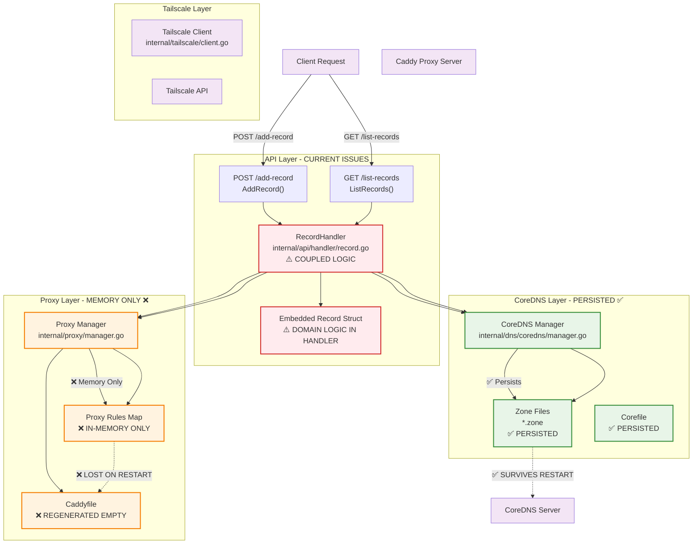
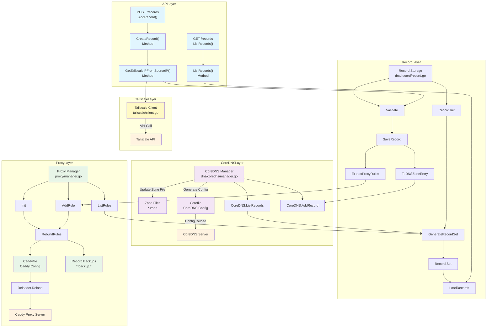

# Record & Proxy Rule Persistence Specification

## Problem Statement

### Current Architecture Issues

The DNS Manager currently has several critical operational and architectural problems:

1. **Service Interruption**: CoreDNS zone files are persisted to disk, but **reverse-proxy rules are only held in memory**. After a pod/container restart, the Caddyfile is regenerated with *no rules*, breaking any HTTP services that were previously exposed

2. **Architecture Coupling**: The API handler in `internal/api/handler/record.go` currently owns a `Record` struct that couples handler logic with data-model logic, violating separation of concerns

3. **Data Loss Risk**: All proxy configurations are lost on restart, requiring manual reconfiguration of services

4. **Inconsistent Persistence**: DNS records persist through CoreDNS zone files, but proxy rules do not persist, creating an inconsistent data model

5. **Tight Coupling**: Record creation logic is embedded in HTTP handlers, making it difficult to reuse and test independently

6. **No Unified View**: There's no way to get a unified view of all records that combines both DNS A records and proxy rules

### Impact Assessment

- **High Severity**: Complete service outage for all proxied services after restart
- **Manual Recovery**: Requires re-adding all proxy rules manually after each restart
- **Development Friction**: Tightly coupled architecture makes testing and maintenance difficult
- **Operational Risk**: No backup or recovery mechanism for proxy configurations
- **Inconsistent State**: DNS and proxy configurations can become out of sync

## Solution Overview

Implement **Runtime Record Generation** with **Clean Architecture Separation** that:

1. **Unified Record Model**: Create a dedicated `dns/record` package with a unified `Record` type that encompasses both DNS and proxy rule data
2. **Runtime Generation**: Generate records at runtime by reading existing persisted DNS zone files and Caddyfile entries
3. **Automatic Restoration**: On startup, automatically restore proxy rules by ensuring Caddyfile persistence and proper initialization
4. **Clean API Layer**: Extract record domain logic from HTTP handlers into the `dns/record` package, keeping handlers thin and focused on HTTP concerns
5. **Backward Compatibility**: Maintain existing API contracts while improving internal architecture

## Objectives

1. **Runtime Record Assembly** – Generate unified `Record` structs at runtime by combining data from persisted DNS zone files and Caddyfile entries
2. **Proxy Self-Restore** – On startup, ensure the `proxy.Manager` loads from persisted Caddyfile and maintains proxy rules across restarts
3. **Clean Architecture** – Extract record domain logic into `dns/record` package so HTTP handlers remain thin and focused on HTTP concerns
4. **Data Consistency** – Ensure DNS zone files and Caddyfile remain the single source of truth for their respective domains
5. **API Compatibility** – Maintain existing API request/response schemas while improving internal structure

## Architecture Overview

### Current Record Flow

The following diagram illustrates the current architecture and data flow, highlighting the problems with the existing implementation:



### Proposed Architecture



## Technical Design

### Key Components

#### 1. Record Domain Package (`dns/record/`)

A new dedicated package that encapsulates all record-related domain logic, extracted from the API layer:

**Package Structure:**
```
dns/record/
├── record.go      # Core Record model and types
├── service.go     # Business logic and orchestration
├── storage.go     # Persistence layer
├── validation.go  # Input validation logic
└── types.go       # Supporting types and interfaces
```

#### 2. Unified Record Model (`dns/record/record.go`)

The core data structure that unifies DNS and proxy configuration:

```go
package record

import (
    "time"
    "github.com/jerkytreats/dns/internal/proxy"
)

// Record represents a unified DNS record with optional proxy rule
type Record struct {
    // DNS Record Fields
    Name      string    `json:"name"`       // FQDN: api.internal.jerkytreats.dev
    Type      string    `json:"type"`       // A, AAAA, CNAME, etc.
    Value     string    `json:"value"`      // IP address or target
    TTL       int       `json:"ttl"`        // Time to live (default: 300)

    // Proxy Rule (Optional)
    ProxyRule *ProxyRule `json:"proxy_rule,omitempty"`

    // Metadata
    CreatedAt   time.Time `json:"created_at"`
    UpdatedAt   time.Time `json:"updated_at"`
}

// ProxyRule represents reverse proxy configuration
type ProxyRule struct {
    Enabled    bool   `json:"enabled"`
    TargetIP   string `json:"target_ip"`   // 100.64.1.10 (actual service IP)
    TargetPort int    `json:"target_port"` // 8080 (actual service port)
    Protocol   string `json:"protocol"`    // http/https
}

// CreateRecordRequest represents the input for creating a new record
type CreateRecordRequest struct {
    ServiceName string `json:"service_name"`
    Name        string `json:"name"`
    Port        *int   `json:"port,omitempty"` // Triggers proxy rule creation
    SourceIP    string `json:"-"`              // Extracted from HTTP request
}
```

#### 3. Record Service (`dns/record/service.go`)

Business logic layer that orchestrates record operations:

```go
// Service orchestrates record operations across DNS and proxy layers
type Service struct {
    dnsManager      *coredns.Manager
    proxyManager    proxy.ProxyManagerInterface
    tailscaleClient tailscale.TailscaleClientInterface
    generator       *Generator
    validator       Validator
}

// CreateRecord creates a new record with DNS and optional proxy rule
func (s *Service) CreateRecord(req CreateRecordRequest) (*Record, error) {
    // 1. Validate input
    if err := s.validator.ValidateCreateRequest(req); err != nil {
        return nil, err
    }

    // 2. Resolve DNS Manager IP for DNS record
    dnsManagerIP, err := s.tailscaleClient.GetDNSManagerIP()
    if err != nil {
        return nil, err
    }

    // 3. Create DNS record first
    if err := s.dnsManager.AddRecord(req.ServiceName, req.Name, dnsManagerIP); err != nil {
        return nil, err
    }

    // 4. Create proxy rule if port specified
    if req.Port > 0 {
        targetIP, err := s.tailscaleClient.ResolveDeviceIP(req.SourceIP)
        if err != nil {
            return nil, err
        }

        proxyRule := &proxy.ProxyRule{
            Hostname:   req.Name,
            TargetIP:   targetIP,
            TargetPort: req.Port,
            Protocol:   "http",
            Enabled:    true,
        }

        if err := s.proxyManager.AddRule(proxyRule); err != nil {
            return nil, err
        }
    }

    // 5. Generate the unified record view from persisted sources
    records, err := s.generator.GenerateRecords()
    if err != nil {
        return nil, fmt.Errorf("failed to generate record view: %w", err)
    }

    // 6. Find and return the newly created record
    for _, record := range records {
        if record.Name == req.Name {
            return &record, nil
        }
    }

    return nil, fmt.Errorf("record not found after creation")
}

// ListRecords returns all records by generating them from persisted sources
func (s *Service) ListRecords() ([]Record, error) {
    return s.generator.GenerateRecords()
}
```

#### 4. Runtime Record Generator (`dns/record/generator.go`)

Runtime generation of records from existing persisted sources:

```go
// Generator creates Record structs by reading from persisted DNS and proxy sources
type Generator struct {
    dnsManager   *coredns.Manager
    proxyManager *proxy.Manager
}

// GenerateRecords creates unified Record structs from existing DNS zones and proxy rules
func (g *Generator) GenerateRecords() ([]Record, error) {
    var records []Record

    // Get all DNS A records from zone files
    dnsRecords, err := g.dnsManager.ListAllARecords()
    if err != nil {
        return nil, fmt.Errorf("failed to list DNS records: %w", err)
    }

    // Get all proxy rules from Caddyfile
    proxyRules, err := g.proxyManager.ListAllRules()
    if err != nil {
        return nil, fmt.Errorf("failed to list proxy rules: %w", err)
    }

    // Create map of proxy rules by hostname for efficient lookup
    proxyMap := make(map[string]*proxy.ProxyRule)
    for _, rule := range proxyRules {
        proxyMap[rule.Hostname] = rule
    }

    // Generate unified records
    for _, dnsRecord := range dnsRecords {
        record := Record{
            Name:  dnsRecord.Name,
            Type:  dnsRecord.Type,
            Value: dnsRecord.Value,
            TTL:   dnsRecord.TTL,
        }

        // Add proxy rule if one exists for this hostname
        if proxyRule, exists := proxyMap[dnsRecord.Name]; exists {
            record.ProxyRule = &ProxyRule{
                Enabled:    proxyRule.Enabled,
                TargetIP:   proxyRule.TargetIP,
                TargetPort: proxyRule.TargetPort,
                Protocol:   proxyRule.Protocol,
            }
        }

        records = append(records, record)
    }

    return records, nil
}
```

#### 5. Enhanced Proxy Manager

Extend existing proxy manager to ensure Caddyfile persistence and proper initialization:

```go
// NEW: Initialize proxy manager with Caddyfile persistence
func (m *Manager) InitializeWithPersistence() error {
    if !m.enabled {
        return nil
    }

    // Ensure Caddyfile exists and is readable
    if err := m.ensureCaddyfileExists(); err != nil {
        return fmt.Errorf("failed to ensure Caddyfile exists: %w", err)
    }

    // Load existing rules from Caddyfile if it exists
    existingRules, err := m.loadRulesFromCaddyfile()
    if err != nil {
        logging.Warn("Failed to load existing rules from Caddyfile: %v", err)
        return nil // Continue with empty rules
    }

    // Initialize internal rule tracking
    m.rules = existingRules

    logging.Info("Initialized proxy manager with %d existing rules from Caddyfile", len(existingRules))
    return nil
}

// NEW: Load proxy rules from existing Caddyfile
func (m *Manager) loadRulesFromCaddyfile() ([]*ProxyRule, error) {
    // Parse existing Caddyfile and extract proxy rules
    // This ensures continuity across restarts
    return m.parseCaddyfileRules()
}

// NEW: List all current proxy rules
func (m *Manager) ListAllRules() ([]*ProxyRule, error) {
    if !m.enabled {
        return nil, nil
    }

    m.mutex.RLock()
    defer m.mutex.RUnlock()

    rules := make([]*ProxyRule, len(m.rules))
    copy(rules, m.rules)
    return rules, nil
}
```

#### 6. Refactored API Handler

Thin HTTP layer that delegates to the record service:

```go
// RecordHandler handles HTTP requests for record operations
type RecordHandler struct {
    recordService *record.Service
}

// AddRecord handles POST /add-record requests
func (h *RecordHandler) AddRecord(w http.ResponseWriter, r *http.Request) {
    var apiReq AddRecordRequest
    if err := json.NewDecoder(r.Body).Decode(&apiReq); err != nil {
        http.Error(w, "Invalid request body", http.StatusBadRequest)
        return
    }

    // Convert API request to domain request
    req := record.CreateRecordRequest{
        ServiceName: apiReq.ServiceName,
        Name:        apiReq.Name,
        Port:        apiReq.Port,
        SourceIP:    proxy.GetSourceIP(r),
    }

    // Delegate to service layer
    record, err := h.recordService.CreateRecord(req)
    if err != nil {
        http.Error(w, err.Error(), http.StatusInternalServerError)
        return
    }

    // Convert and return response
    response := convertToAPIRecord(record)
    w.Header().Set("Content-Type", "application/json")
    w.WriteHeader(http.StatusCreated)
    json.NewEncoder(w).Encode(response)
}
```

## File Changes Required

### New Files

| File Path | Description | Purpose |
|-----------|-------------|----------|
| `dns/record/record.go` | Core record model and types | Define unified Record struct with DNS + proxy data |
| `dns/record/service.go` | Business logic orchestration | Handle record creation, validation, and coordination |
| `dns/record/generator.go` | Runtime record generation | Generate unified records from DNS zones and Caddyfile |
| `dns/record/validation.go` | Input validation logic | Extract validation from handlers |
| `dns/record/types.go` | Supporting types and interfaces | Common types and interface definitions |

### Modified Files

| File Path | Changes Required | Impact |
|-----------|------------------|--------|
| `internal/api/handler/record.go` | Remove embedded Record struct, delegate to service | **MAJOR** - Complete refactor to thin handler |
| `internal/proxy/manager.go` | Add RestoreFromStorage method | **MEDIUM** - Add restoration capability |
| `cmd/api/main.go` | Wire record service and storage | **MEDIUM** - Update dependency injection |
| `internal/config/config.go` | Add record storage configuration keys | **MINOR** - New config keys |

## Implementation Status

### Phase 1: Core Record Domain Package

| Component | Status | Description | Dependencies | Priority |
|-----------|--------|-------------|--------------|----------|
| **Record Model** | ⏳ TODO | Define unified Record struct | None | **HIGH** |
| **Runtime Generator** | ⏳ TODO | Generate records from DNS + Caddyfile | DNS Manager + Proxy Manager | **HIGH** |
| **Validation Logic** | ⏳ TODO | Extract from API handlers | Record Model | **MEDIUM** |
| **Record Service** | ⏳ TODO | Business logic orchestration | Generator + Validation | **HIGH** |
| **Proxy Enhancement** | ⏳ TODO | Add Caddyfile persistence + initialization | None | **HIGH** |
| **API Refactoring** | ⏳ TODO | Thin handlers using service | Record Service | **MEDIUM** |
| **Configuration** | ⏳ TODO | Add generation config keys | None | **LOW** |

### Phase 2: Proxy Manager Enhancement

| Component | Status | Description | Dependencies | Priority |
|-----------|--------|-------------|--------------|----------|
| Persistent Caddyfile | ⏳ TODO | Add backup capability to proxy manager | Record Storage | HIGH |
| Trigger Backups | ⏳ TODO | Trigger Backups on Caddyfile change | Record Storage | HIGH |
| Startup Restoration | ⏳ TODO | Initialize restoration on application start | Application Wiring | HIGH |

### Phase 3: Record Service Layer

| Component | Status | Description | Dependencies | Priority |
|-----------|--------|-------------|--------------|----------|
| Service Struct | ⏳ TODO | Create Service with all dependencies | Record Storage, Proxy Manager | HIGH |
| CreateRecord Method | ⏳ TODO | Orchestrate record creation with DNS + proxy | Service Struct | HIGH |
| ListRecords Method | ⏳ TODO | Return all records from generator | Service Struct | MEDIUM |
| Device Detection Integration | ⏳ TODO | Integrate Tailscale client for IP resolution | CreateRecord Method | HIGH |
| Error Handling | ⏳ TODO | Add comprehensive error handling with rollback | All Service Methods | MEDIUM |

### Phase 4: API Handler Refactoring

| Component | Status | Description | Dependencies | Priority |
|-----------|--------|-------------|--------------|----------|
| Handler Refactoring | ⏳ TODO | Remove embedded Record type, use dns/record | Record Service | HIGH |
| Request/Response Mapping | ⏳ TODO | Convert between API and domain types | Handler Refactoring | HIGH |
| Dependency Injection | ⏳ TODO | Wire record service in handler constructor | Record Service | MEDIUM |
| API Compatibility | ⏳ TODO | Ensure request/response schemas unchanged | Request/Response Mapping | HIGH |
| Handler Tests | ⏳ TODO | Update handler tests for new implementation | All Phase 4 components | MEDIUM |
